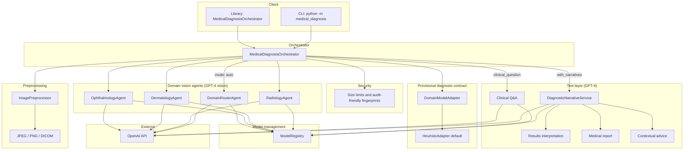

# Medical Image Diagnosis by AI Agents

Multi-agent application for medical image diagnosis with:

- image preprocessing (JPEG/PNG/DICOM)
- GPT-4 vision routing and specialty analysis (radiology/dermatology/ophthalmology)
- pipeline **guardrails** (non-medical gating, JSON schema checks, low-confidence narrative suppression)
- a normalized `provisional_diagnosis` contract
- GPT-4 reporting, contextual advice, and clinician Q&A
- a web UI for upload, results viewing, and follow-up questions

## High-level architecture




### Request flow

1. **Input** — Image path via CLI or `MedicalDiagnosisOrchestrator.run()`.
2. **Security** — Enforces max file size; logs content fingerprints instead of raw pixels.
3. **Preprocessing** — Decode, resize (224×224 for radiology/dermatology, 256×256 for ophthalmology), normalize; prepares base64 for the API.
4. **Routing** (`--domain auto`) — `DomainRouterAgent` picks radiology, dermatology, or ophthalmology. For **radiology**, the router also returns `radiology_subspecialty_route` (`general` \| `breast` \| `neuro` \| `unclear`) so the pipeline can pick the right vision agent.
5. **Specialist** — Vision agents: general `RadiologyAgent`, `BreastImagingAgent`, `NeuroImagingAgent`, plus dermatology and ophthalmology. Radiology-family outputs share one JSON shape (including `imaging_modality`, `anatomical_region`, `radiology_subspecialty`).
6. **Adapter** — Default `HeuristicAdapter` maps specialist output to `diagnosis.provisional_diagnosis` (`diagnosis_label`, `confidence`, `triage_level`, `rationale`, `differential_diagnoses`). Replace with real model-backed adapters without changing the orchestrator shape.
7. **Narratives (optional)** — Lay interpretation, report body, and provider-oriented contextual advice from the same diagnostic bundle.
8. **Q&A (optional)** — Follow-up questions grounded in the bundle; can also run from a saved JSON (`--bundle` + `--ask`).
9. **Observability** — `ModelRegistry` tracks logical model metadata, inference counts, and latency per agent type.

### Radiology subspecialty (breast imaging & neuroimaging)

User-facing **`domain`** stays `radiology` \| `dermatology` \| `ophthalmology` \| `auto`. When the case is **radiology**, the orchestrator resolves a subspecialty track:

| Source | Behavior |
| --- | --- |
| **Auto routing** | Router’s `radiology_subspecialty_route` chooses `breast`, `neuro`, or `general`; `unclear` falls back to **general**. |
| **Manual override** | CLI: `--radiology-subspecialty general\|breast\|neuro`. Library: `run(..., radiology_subspecialty="breast")`. Web/API: form field `radiology_subspecialty`. Overrides router hints when set. |
| **Non-radiology domains** | Subspecialty is ignored; `routing` omits `radiology_subspecialty` fields. |

`routing` in the response includes `radiology_subspecialty` and `radiology_subspecialty_source` (`user_override`, `router`, `router_unclear_default`, or `default`) when the clinical domain is radiology. The model registry records **`radiology`**, **`breast_imaging`**, or **`neuro_imaging`** for the specialist step. This remains **single-frame** demo scope (not full DICOM series workflows).

## Guardrails

The orchestrator adds a top-level **`guardrails`** object on every `run()` response (CLI JSON, library, and `POST /api/diagnose` via `result.guardrails`). Use it in integrations to drive UI (blocked state, review banners) and logging.

### Behaviour (summary)

| Stage | What is checked |
| --- | --- |
| **Router** (`--domain auto`) | Full router JSON must match the expected shape, including `medical_image_assessment` and (when `domain` is radiology) `radiology_subspecialty_route`. |
| **Image gate** (manual domain) | Same `medical_image_assessment` shape before the specialist runs. |
| **Non-medical / non-clinical** | If assessment confidence is at least **`GUARDRAILS_MEDICAL_BLOCK_MIN_CONFIDENCE`** and the model marks the image as non-clinical or `category_hint: non_medical`, the pipeline **blocks**: no specialist, no real narratives, stub `diagnosis`. |
| **Specialist** | Output validated per-domain (required fields, enums, confidence in \[0, 1\]). Invalid JSON → indeterminate `provisional_diagnosis`, placeholder narratives, follow-up Q&A disabled for that bundle. |
| **Narrative layer** | If specialist `confidence` is **below** **`GUARDRAILS_NARRATIVE_MIN_CONFIDENCE`**, GPT reporting is **not** called; `results_interpretation` / `medical_report` / `contextual_advice` contain a fixed placeholder explaining why. |

### Tuning thresholds (environment variables)

Set these in `.env` or the process environment. Values are read in `medical_diagnosis/config.py` and clamped to \[0, 1\].

| Variable | Default | Role |
| --- | --- | --- |
| `GUARDRAILS_MEDICAL_BLOCK_MIN_CONFIDENCE` | `0.6` | Minimum router/gate **confidence** required to **act** on a non-clinical or `non_medical` assessment and stop the pipeline. **Raise** (e.g. `0.7`) if legitimate images are blocked too often. **Lower** (e.g. `0.5`) if too much non-medical content still reaches the specialist. |
| `GUARDRAILS_NARRATIVE_MIN_CONFIDENCE` | `0.55` | Specialist `confidence` must be **≥** this for the narrative GPT layer to run. **Lower** (e.g. `0.45`) if placeholders appear too often for acceptable cases. **Raise** (e.g. `0.65`) to keep weak vision output from getting automated reports. |

The response also echoes the active cutoffs under `guardrails.thresholds` for debugging.

### `guardrails` object (reference)

Typical fields (all optional except where noted):

- **`pipeline_status`**: `"ok"` or `"blocked"`.
- **`blocked_reason`**: machine-readable reason when blocked (for example `router_output_schema_validation_failed`, `model_assessment_non_clinical_medical_image`).
- **`medical_image_assessment`**: copy of the model’s assessment object when present (`is_clinical_medical_image`, `confidence`, `category_hint`, `brief_reason`).
- **`router_validation_errors`** / **`gate_validation_errors`**: lists of strings when router or gate JSON fails validation.
- **`specialist_schema_valid`**: `true` / `false` / `null` (latter if specialist never ran).
- **`specialist_schema_errors`**: list of strings when the specialist output fails schema checks.
- **`low_confidence_review_required`**: `true` when confidence is below the narrative threshold or validation failed.
- **`narratives_suppressed`**: `true` when the narrative service was skipped or replaced by placeholders.
- **`narratives_suppressed_reason`**: short string (for example `specialist_confidence_below_narrative_threshold`).
- **`thresholds`**: `{ "medical_block_min_confidence", "narrative_min_confidence" }` reflecting the configured values.

When **`pipeline_status`** is **`blocked`** or **`specialist_schema_valid`** is **`false`**, follow-up **`answer_question`** / `POST /api/qa` is rejected for that bundle (by design).

### External dependency

- **OpenAI** — Vision and text steps use `OPENAI_API_KEY` (and optional `OPENAI_MODEL`, default `gpt-4o`). See `medical_diagnosis/config.py`.

### Extension points

- **Domain models** — Implement `DomainModelAdapter` in `medical_diagnosis/adapters.py` and pass a custom `adapters` map into `MedicalDiagnosisOrchestrator`.

## Web UI

Simple FastAPI UI is included with:

- image upload and diagnosis trigger
- human-readable diagnosis summary (sections for plain language, care-team summary, next steps, and image findings)
- collapsible **Technical details (JSON)** for the full API-shaped payload
- medical-expert Q&A with a readable answer plus optional JSON details

## How to run the application

### 1) Setup

```bash
git clone https://github.com/ebunilo/medical_image_diagnosis.git
cd medical_image_diagnosis
python -m venv .venv
source .venv/bin/activate
pip install -r requirements.txt
```


Create `.env` in the project root:

```bash
OPENAI_API_KEY=your_api_key_here
# optional
OPENAI_MODEL=gpt-4o

# optional — pipeline guardrails (see “Guardrails” above)
# GUARDRAILS_MEDICAL_BLOCK_MIN_CONFIDENCE=0.6
# GUARDRAILS_NARRATIVE_MIN_CONFIDENCE=0.55
```

### 2) Run Web UI (recommended)

```bash
uvicorn medical_diagnosis.webapp:app --reload --port 8000
```

Open [http://localhost:8000](http://localhost:8000).

### 3) Run CLI (optional)

Diagnose an image:

```bash
python -m medical_diagnosis images/chest_x_01.png --domain auto
```

Ask a question in the same run:

```bash
python -m medical_diagnosis images/chest_x_01.png --ask "What limitations are most important?"
```

Q&A from a saved bundle:

```bash
python -m medical_diagnosis --bundle /path/to/prior_run.json --ask "What follow-up is recommended?"
```

### 4) API endpoints used by the UI

- `POST /api/diagnose` — multipart upload (`image`, `domain`, optional `patient_context`)
- `POST /api/qa` — form request (`bundle_id`, `question`)
- `GET /` — serves the web UI

