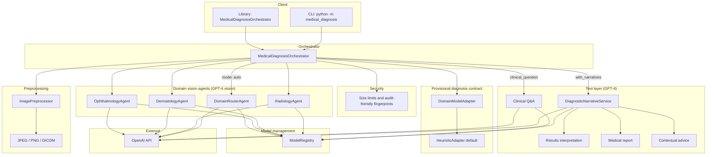

# Medical Image Diagnosis by AI Agents

Multi-agent pipeline for medical-style image analysis: preprocessing, optional domain routing, GPT-4 vision specialists, a **provisional diagnosis** adapter layer, and an optional GPT-4 text layer (interpretation, reports, contextual advice, clinician Q&A).

## High-level architecture

### Request flow

1. **Input** — Image path via CLI or `MedicalDiagnosisOrchestrator.run()`.
2. **Security** — Enforces max file size; logs content fingerprints instead of raw pixels.
3. **Preprocessing** — Decode, resize (224×224 for radiology/dermatology, 256×256 for ophthalmology), normalize; prepares base64 for the API.
4. **Routing** (`--domain auto`) — `DomainRouterAgent` picks radiology, dermatology, or ophthalmology.
5. **Specialist** — Domain agent returns structured JSON (findings, impression/classification, confidence, recommendations, etc.).
6. **Adapter** — Default `HeuristicAdapter` maps specialist output to **`diagnosis.provisional_diagnosis`** (`diagnosis_label`, `confidence`, `triage_level`, `rationale`, `differential_diagnoses`). Replace with real model-backed adapters without changing the orchestrator shape.
7. **Narratives (optional)** — Lay interpretation, report body, and provider-oriented contextual advice from the same diagnostic bundle.
8. **Q&A (optional)** — Follow-up questions grounded in the bundle; can also run from a saved JSON (`--bundle` + `--ask`).
9. **Observability** — `ModelRegistry` tracks logical model metadata, inference counts, and latency per agent type.

### External dependency

- **OpenAI** — Vision and text steps use `OPENAI_API_KEY` (and optional `OPENAI_MODEL`, default `gpt-4o`). See `medical_diagnosis/config.py`.

### Extension points

- **Domain models** — Implement `DomainModelAdapter` in `medical_diagnosis/adapters.py` and pass a custom `adapters` map into `MedicalDiagnosisOrchestrator`.
- **HTTP API** — Not included; wrap `MedicalDiagnosisOrchestrator` if you need REST.

For implementation details and agent responsibilities, see `agent.md`.
